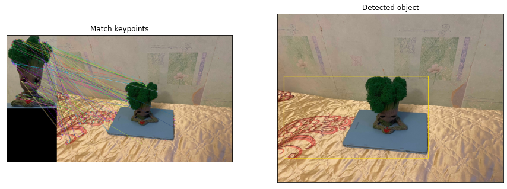

<h1>Детектирование изображений</h1>
<h2>Входящие файлы</h2>
<li>4140_CV_ЛР2_Строкова.ipynb - ноутбук с программным кодом на Python;
<li>4140_CV_ЛР2_Строкова.pdf - текстовый отчет;
<li>Каталог "Изображения" - исходные и итоговые изображения.
<h2>Постановка задачи</h2>
Цель работы: исследовать простейшие алгоритмы детектирования объектов на изображении.  
 
Базовый алгоритм: прямой поиск одного изображения на другом, поиск ключевых точек эталона на входном изображении. 
 
Задание: на вход поступает два изображения: эталон и изображение, на котором будет производиться поиск. На выходе программа должна строить рамку в виде четырехугольника в области, где с наибольшей вероятностью находится искомый объект. 
 
Задачи: 
<li>реализовать алгоритм прямого поиска одного изображения на другом (template matching);
<li>реализовать алгоритм поиска ключевых точек эталона на входном изображении (ORB).
 
<h2>Теоретическая база</h2>
Задача нахождения объектов на изображении – задача машинного обучения, в рамках которой выполняется определение наличия или отсутствия объекта определенного домена на изображении, нахождение границ этого объекта в системе координат пикселей исходного изображения.  
   
В данной работе будет реализован алгоритм детекции объектов. Программный код написан в Google Collaboratory на языке Python.  
   
В первой половине работы использовался алгоритм прямого поиска изображения с помощью библиотеки OpenCV. Для этого бралось изображение объекта на нейтральном фоне, вырезался фрагмент и сохранялся под другим именем. На вход подавалось два изображения, которые алгоритм сравнивал и выводил рамку вокруг детектированного объекта.  
   
Существует несколько методов matching template, в данной работе использовался cv.TM_CCOEFF (находятся глобальные максимумы с помощью функции minMaxLoc). Отмечу, что на вход может подаваться как черно-белое, так и цветное изображение, однако на выходе оно все равно преобразуется в одноканальное.
Во второй половине работы опробован алгоритм ORB (Oriented FAST and Rotated BRIEF).  
 
Алгоритм работает следующим образом: 
<li> Особые точки обнаруживаются при помощи быстрого древовидного FAST (сравнивается яркость пикселей вокруг выбранной точки) на исходном изображении и на уменьшенном.
<li> Для обнаруженных точек вычисляется мера Харриса, кандидаты с низким значением меры Харриса отбрасываются.
<li> Вычисляется угол ориентации особой точки, на основе которого последовательность точек для бинарных сравнений в дескрипторе BRIEF поворачивается.
<li> По полученным точкам вычисляется бинарный дескриптор BRIEF (набор признаков, который характеризует окрестность каждой особой точки).
 
<h2>Прямой поиск одного изображения на другом (Template Matching)</h2>
Для осуществления Template Matching считаем исходное изображение и вырезанный фрагмент, найдем объект, затем выведем итоговые изображения.  

  

<h2>Поиск ключевых точек эталона</h2>
Для алгоритма поиска ключевых точек эталона воспользуемся методом ORB от библиотеки cv2. Алгоритм будет состоять из нескольких этапов: считывание изображения, поиск ключевых точек, их сравнение, наложение рамки на детектируемый объект и вывод результатов на экран. 

<h2>Выводы по работе</h2>
Проведено детектирование объекта на изображении двумя разными методами: методом прямого поиска (matching template) и методом поиска ключевых точек эталона (с помощью метода ORB). 
 
На вход подавались 10 + 1 фотографий, сделанных с разных ракурсов. Также в предпоследнем изображении был выключен искусственный свет, а в последнем – вручную сделана обработка изображения (изменен контраст, насыщенность, яркость цвета). На выходе алгоритм выдавал рамку вокруг детектированного изображения. Можно заметить, что прямой поиск изображения дает лучшие результаты.  
 
Составим сравнительную таблицу, чтобы подтвердить гипотезу о лучшей работе прямого поиска. Будем использовать трех бальную шкалу, где 2 – объект полностью помещен в рамку, 1 – объект частично помещен в рамку (обрезана часть детектируемого изображения, очень большие «лишние» поля вокруг), 0 – изображение не найдено или очень большие границы рамки. 
 
<table border="1">
   <tr>
    <th>№</th>
    <th>Положение объекта</th>
    <th>Template Matching</th>
    <th>ORB</th>
   </tr>
   <tr>
    <td>0</td>
    <td>Исходное изображение</td>
    <td>2</td>
    <td>1</td>
  </tr>
   <tr>
    <td>1</td>
    <td>Снизу справа</td>
    <td>2</td>
    <td>0</td>
  </tr>
   <tr>
    <td>2</td>
    <td>Сверху справа</td>
    <td>2</td>
    <td>0</td>
  </tr>
   <tr>
    <td>3</td>
    <td>Сверху слева</td>
    <td>2</td>
    <td>1</td>
  </tr>
   <tr>
    <td>4</td>
    <td>Снизу слева</td>
    <td>2</td>
    <td>1</td>
  </tr>
   <tr>
    <td>5</td>
    <td>Вид сверху</td>
    <td>1</td>
    <td>0</td>
  </tr>
   <tr>
    <td>6</td>
    <td>Вид с правого бока</td>
    <td>2</td>
    <td>1</td>
  </tr>
   <tr>
    <td>7</td>
    <td>Вид с левого бока</td>
    <td>2</td>
    <td>1</td>
  </tr>
   <tr>
    <td>8</td>
    <td>Вид снизу</td>
    <td>1</td>
    <td>2</td>
  </tr>
   <tr>
    <td>9</td>
    <td>Вечернее освещение</td>
    <td>2</td>
    <td>1</td>
  </tr>
   <tr>
    <td>10</td>
    <td>Ручное изменение цвета</td>
    <td>2</td>
    <td>1</td>
  </tr>
   <tr>
    <td></td>
    <td>Сумма</td>
    <td>20</td>
    <td>9</td>
  </tr>
 </table>
Таким образом, мы видим, что прямой поиск дает результат лучше, чем метод эталонных точек через ORB. Освещение и ручное изменение цветов на фотографиях на результат не повлияли.
